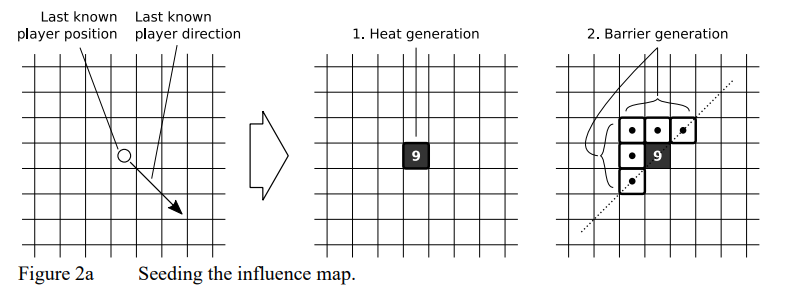
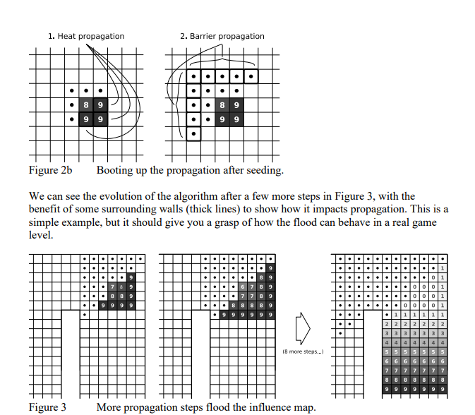
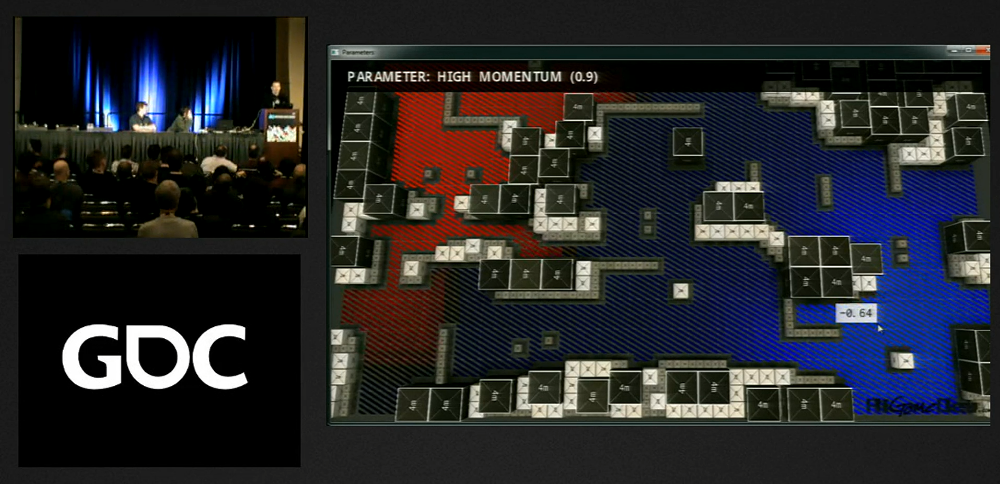
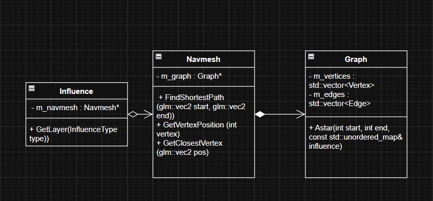

# Influence map in game AI by Hossein Tayebi

## Abstract

This research is focused on using influence map to help game AI navigate better and act smarter in conclusion of using influence data. Influence map has become a technique that is being used in many games to achieve this goal.

In this article I will break down the impacts of influence map on game ai, different algorithms available and its usage in game industry

---

## Table of Contents

1. [Introduction](#introduction)
2. [Background and Related Work](#background-and-related-work)
3. [If you should use influence map](#If-you-should-use-influence-map)
4. [Methodology](#methodology)
5. [Implementation](#implementation)
6. [Results](#results)
7. [Discussion](#discussion)
8. [Conclusion](#conclusion)
9. [References](#references)

---

## Introduction

### Motivation

Game AI plays an important role when it comes to making player's experience immersive and since nowadays, most games have a kind of game AI such as ai companians, enemies or npcs, it's essential to make these AIs smarter in order to improve player's experience quality and make it more challanging. Influence map impacts:

- **Enviromental awareness :** Influence map can be used to increase the ai's awareness by inserting data and summarizing what's happening around them. This helps them with their decision making
- **Prediction :** Influence map can also be used for predicting future events. Like guessing where the player might be based on the last seen position and direction.
- **Memory :** Influence data can be used as some sort of memory where the ai uses the previously inserted data to know what happend and how to act.

### Scope

- What is influence map
- When should you use influence map and when not
- Different approaches in the insdustry


---

## Background and Related Work

### Influence Mapping

Influence map can be represented in any kind of map like 2d grids, graph, area graph and ... but it is important to have a navigation mesh which influence map can operate on because basically how influence map works is that it inserts data on a certain vertex then propagates that through the map.

### Propagation Algorithms

The main concept behind influence map is propagation. It means how you spread data over the map. After doing my research I came across 2 different propagation algorithm that are mostly used in the industry.
- Diffusion based propagation
- Flood-fill propagation

Both have their own pros and cons which I'll talk about it in the upcoming sections.

### Existing Implementations



This is from Laurent Couvidou article on Dishonored 2 implementation which shows how influence propagates in order to estimate where to player will be. I'll explain the algorithm in the implementation section.



Influence map on a 2d grid

---

## If you should use influence map
Using ifluence map is not always the best choice for the game because in some games, the trade offs are just not worth it. If the world is too simple meaning map is small and there aren't lots of terrains on the map, it is a sign that you might not really need an influence map! These kind of worlds/maps can be simplified by distance-based calculation instead benefiting from influence map.

Another factor to consider when you wanna implement influence map is the type of map your using. Rather you are using 2d grid, waypoint graph, area graph or coarse grid, they can all benefit from influence map but it's important to take pros and cons of each map into account because on some maps like 2d grid it'a easier to implement influence map and have more usage while on others might not be as effective.

---

## Methodology

### System Architecture



The diagram above can sumarize my architecture for implementing influence map. Since the map I chose is a waypoint graph, navmesh needs to construct a graph using the file data that is passed to navmesh which the data(Vertices and edges) is extracted in graph's constructor. Of course you can always create a graph outside of navmesh then pass it as a pointer but in this case I had no other use cases for it.
In the next step, navmesh is ready to be used by influence map and influence map has pre-defined influence layers like player, bullet, enemy and ... that the user can propagate influence on them which is operating on the navmesh. On top of the pre-defined layers user can register their own layer type with the interface available.

Let's take a look at how these interfaces work :

```cpp
m_zombieType = influence->RegisterType("Zombie", true);
m_infectionType = influence->RegisterType("Infection", false);
```
Registering a type which returns an id.

```cpp
m_influence->AddDynamicInfluence(pos, m_infectionType, 1.f)
```
Adding a dynamic influence to the desired layer with given value. This influence decays automatically.

```cpp
/// <summary>
/// Adds a static influence at the given position, optionally propagating it through the influence field.
/// </summary>
/// <param name="pos">Position where the influence is applied.</param>
/// <param name="id">Id of the influence to apply.</param>
/// <param name="value">Value of the influence. Defaults to 1.0f.</param>
/// <param name="propagate">Whether the influence should be propagated to surrounding areas. Defaults to true.</param>
/// <param name="flood">If true, use a flood-fill style propagation for broader spreading; otherwise use standard
/// propagation. Defaults to false.</param> <param name="iteration">Number of propagation iterations or depth used when
/// spreading the influence. Defaults to 5.</param>
void AddStaticInfluence(const glm::vec2& pos,
                        int id,
                        float value = 1.f,
                        bool propagate = true,
                        bool flood = false,
                        int iteration = 5);
```
Adding static influence is similar to dynamic but you can choose if you wanna propagate, which algorithm you wanna use and numbers of iteration on top of that.

```cpp
 const auto& playerMap = m_influence->GetLayer(InfluenceType::PLAYER);
 const auto& currentVertex = m_navmesh->GetClosestVertex(aiController.ref);
  
 auto enemyMap = m_influence->GetLayer(InfluenceType::ENEMY);
 m_influence->SubtractLayers(enemyMap, playerMap);
 const auto value = enemyMap.find(currentVertex);
 ```
 This is an example of how you can mix 2 layers of influence using the provided interfaces.


### Algorithm Selection

There are many different algorithms that you can use to propagate the influence but the best ones I found are Gamedev (inspired by gdc talk) diffusion-based propagation algorithm which is based on gdc talk and Dishonored 2 flood-fill propagation.

**Diffusion-based Propagation (GameDev.net):**
- Influence spreads gradually from sources using exponential decay
- Values blend smoothly with neighbors using momentum (linear interpolation)
- Creates natural gradients that decay over distance
- Continuous propagation every frame with multiple iterations

**Flood-fill Propagation (Dishonored 2):**
- Hot cells (value = 1.0) spread to untouched neighbors in a single step
- Previously hot cells begin cooling in subsequent iterations
- Creates expanding wavefronts with sharp leading edges

Since both of them are practical in their own aspects I used a hybrid system where I use flood-fill for predicting player's position after losing sight because this algorithm works well with diretion and events.

On the other hand I used diffusion-based for every other source of influence since with this algorithm, influence gradually decays over time, the influence propagation can be updated every frame and it's easy to combine muliple sources.

---

## Implementation

### Diffusion Algorithm

```cpp
std::unordered_map<int, float> newLayer;
newLayer.reserve(influencedVertices.size());

for (int i : influencedVertices)
{
    float maxInf = 0.0f;

    for (const auto& neighbor : graph.GetNeighbors(i))
    {
        auto it = influenceLayer.find(neighbor);
        if (it == influenceLayer.end() || it->second == 0.0f) continue;

        float dist = glm::length(positions[i] - positions[neighbor]);
        float inf = it->second * expf(-dist * m_decay);
        maxInf = std::max(inf, maxInf);
    }

    auto it = influenceLayer.find(i);
    float currentInf = (it != influenceLayer.end()) ? it->second : 0.0f;

    float newInf = glm::mix(currentInf, maxInf, m_momentum);

    if (newInf > 0.001f)
    {
        newLayer[i] = newInf;
    }
}

influenceLayer = std::move(newLayer);  
```
This code is inspired by gamedev implementation from gdc talk with a bit of optimization for it work well on a larger scale. Let's break it down :

First of all there are 2 important parameter in this algorithm which dictates how the influence should propagate.

**1-Decay**

This parameter tells algorithm how much the influence decays by distance and how fast it should decay with time. The bigger it is, the faster it decays. User can change this parameter with influence.SetDecay() method.

**2-Momentum**

Momentum indicates how fast and how far the influence propagates through out the map. Same as decay, the bigger it is the faster it gets. User can change this parameter with influence.SetMomentum() method.

**How it works**

The user chooses a position to insert influence at then the propagation starts. The optimized version of this algorithm collects vertices' position and cache them so later when we need them it can access it instantly. Next step is collecting the vertices that are already influenced + their neighbors, this means all the vertices that we need. After that each vertex finds the highest influence value based also on the distance among its neighbor, then mix the value with current influence value using momentum.

### Flood-Fill Algorithm

```cpp
for (int i = 0; i < iteration; i++)
{
    if (map.size() > maxHeatCells) break;
    auto previousMap = map;
    std::vector<int> influencedVertices;
    for (const auto& [vertex, heat] : map)
    {
        if (heat >= 1.0f)
        {
            influencedVertices.push_back(vertex);
        }
    }

    for (const auto& vertex : influencedVertices)
    {
        const auto& neighbors = m_navmesh->GetGraph().GetNeighbors(vertex);
        for (const auto& neighbor : neighbors)
        {
            if (m_influences[static_cast<int>(InfluenceType::BARRIER)].layer[neighbor] > 0.0f) continue;
            auto it = previousMap.find(neighbor);
            if (it == previousMap.end() || it->second == 0.0f) map[neighbor] = 1.0f;
        }
    }

    for (auto& [vertex, influence] : map)
    {
        if (previousMap.count(vertex) && previousMap[vertex] < 1.0f && previousMap[vertex] > 0.0f)
            influence = std::max(0.0f, influence - 0.1f);

        else if (previousMap.count(vertex) && previousMap[vertex] >= 1.0f)
            influence -= 0.1f;
    }
}
```


### Integration

[How they work together]

---

## Results

### Performance Metrics

[Numbers, graphs, tables]

### Behavioral Outcomes

[How AI behaves with your system]

### Comparative Analysis

[Comparing different approaches]

---

## Discussion

### Findings

[What you learned]

### Limitations

[What didn't work or needs improvement]

### Trade-offs

[Design decisions and their implications]

---

## Conclusion

### Summary

[Key takeaways]

### Future Work

[What could be done next]

### Applications

[Where else this could be used]

---

## References

1. [Reference 1]
2. [Reference 2]
3. [Reference 3]

---

## Appendices

### Appendix A: Code Samples

[If needed]

### Appendix B: Additional Data

[If needed]

---